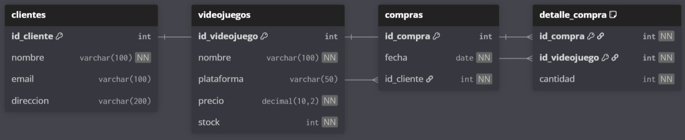

# 🎮 Proyecto Base de Datos - Tienda de Videojuegos

Este proyecto fue desarrollado como parte del bootcamp **Full Stack Python Trainee - Skillnest**, con el objetivo de demostrar el dominio de tecnologías de gestión de bases de datos relacionales usando **MySQL**. El proyecto representa un sistema básico de gestión de una tienda de videojuegos, cubriendo todas las operaciones esenciales de una base de datos: creación, manipulación y consulta de datos.

---

## 📚 Contenidos del Repositorio

- `proyecto_tienda_videojuegos.sql`: Script único que incluye todo el flujo del proyecto:
  - Creación de base de datos y tablas
  - Inserción, actualización y eliminación de datos
  - Relaciones con claves primarias y foráneas
  - Consultas SQL básicas y avanzadas (SELECT, JOIN, GROUP BY, subconsultas)
  - Restricciones de integridad

- `diagrama_entidad_relación.jpg`: Imagen del **diagrama entidad-relación (ER)** del modelo de datos utilizado.

---

## 🧠 Descripción del Modelo de Datos

El sistema simula una tienda de videojuegos, gestionando:

- **Clientes**: nombre, email y dirección
- **Videojuegos**: nombre, plataforma, precio y stock
- **Compras**: relación entre clientes y productos con fecha
- **Detalle de compras**: tabla intermedia con la cantidad comprada por videojuego

---

## 🗂 Diagrama Entidad-Relación

El siguiente diagrama representa gráficamente las entidades y relaciones del sistema:

---

## 🧪 Consultas Incluidas

Dentro del archivo SQL encontrarás ejemplos de:

- Consultas básicas: productos, clientes, stock disponible
- Consultas con JOIN: detalle de compras por cliente
- Consultas con funciones agregadas: `SUM`, `GROUP BY`
- Subconsultas: productos sin ventas, totales por cliente

---

## 🔧 Instrucciones de Uso

1. Abre tu gestor de bases de datos MySQL (MySQL Workbench, DBeaver, etc.)
2. Ejecuta el archivo `proyecto_tienda_videojuegos.sql`
3. Revisa y prueba las consultas incluidas
4. Observa el diagrama `diagrama_entidad_relación.jpg` para comprender el diseño del modelo

---

## 📝 Tecnologías Utilizadas

- MySQL
- SQL (DDL y DML)
- dbdiagram.io (para diseño del ER)
- Git / GitHub

---

## ✅ Objetivos de Aprendizaje Alcanzados

✔️ Definición de claves primarias y foráneas  
✔️ Gestión de relaciones entre tablas  
✔️ Consultas SQL con JOIN, GROUP BY y subconsultas  
✔️ Manipulación de datos con INSERT, UPDATE y DELETE  
✔️ Modelado de datos con diagrama ER  
✔️ Organización y documentación del proyecto en GitHub  

---

## 📌 Autor

**Estefany Rodríguez**  
Bootcamp Full Stack Python
Septiembre 2025

---

